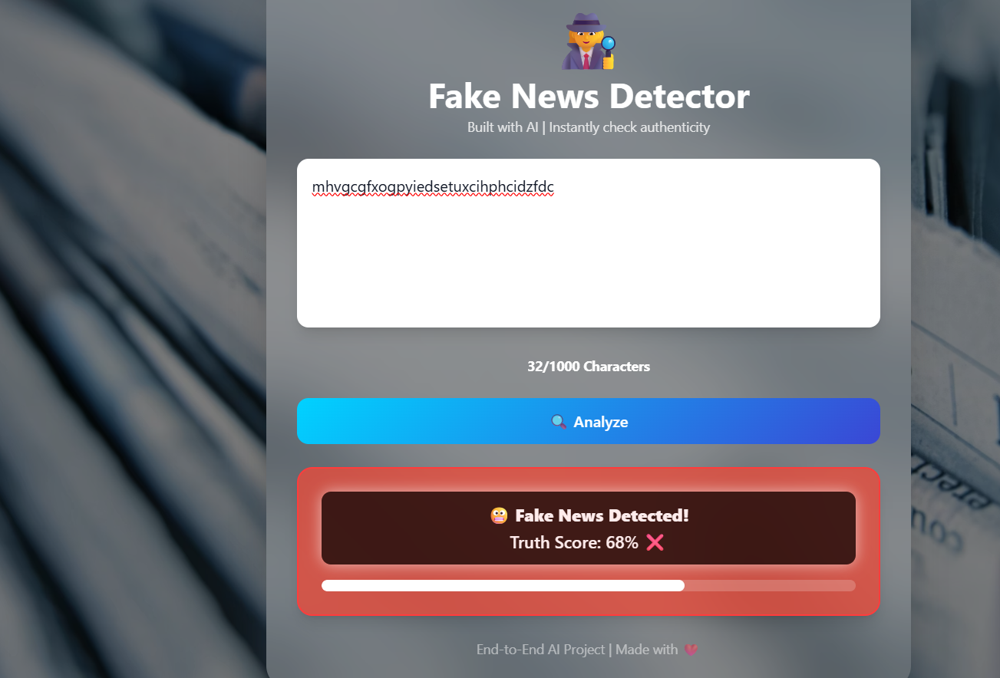
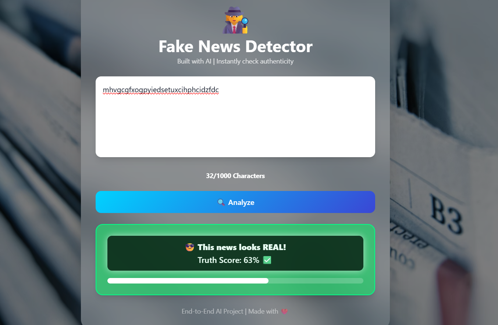

# Fake News Detector

This is a full-stack web application that allows users to check the authenticity of news articles and headlines. Built using Python, Flask, and a trained ML model with TF-IDF vectorization, the app predicts whether a piece of news is REAL or FAKE and provides a confidence score.

## Features
- User authentication with signup and login
- Personalized greeting on the prediction page
- Input box to paste news or headlines
- Real-time prediction with confidence percentage
- Responsive and modern UI with Tailwind CSS
- Session-based login to keep users authenticated
- Optional: Logout functionality

## Tech Stack
- Python, Flask
- SQLite for user database
- Scikit-learn for ML model
- HTML, CSS, JavaScript, Tailwind CSS for frontend

## Usage
1. Signup or login
2. Paste news text in the input box
3. Click 'Analyze' to check if the news is real or fake
4. View the confidence score of the prediction

## Model
- Pre-trained ML model saved as `fake_news.pkl`
- TF-IDF vectorizer saved as `tfidf_vectorizer.pkl`

