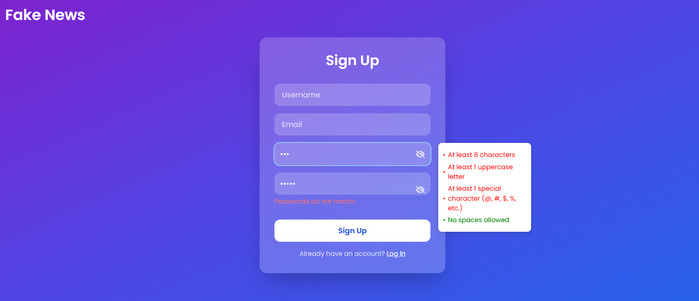
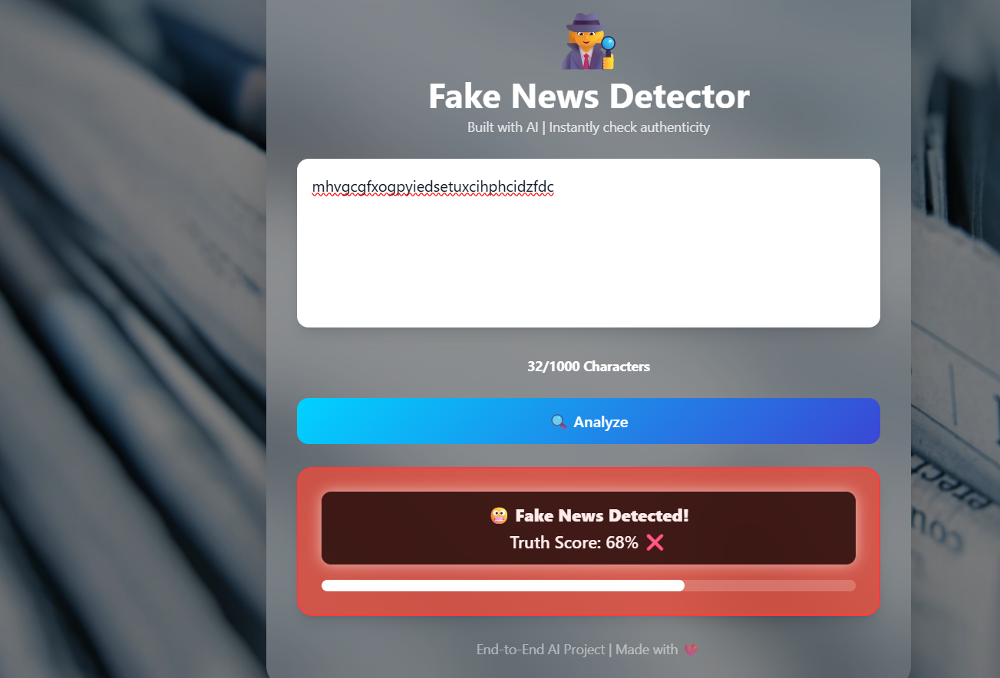
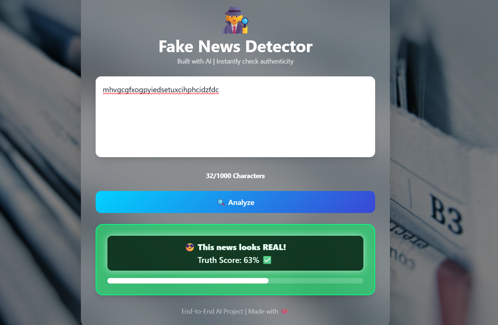

# Fake News Detector

This is my **final year project**, where I applied my AI/ML and NLP skills to build a **web-based fake news detection tool**. I trained a machine learning model using a merged dataset of `True` and `Fake` news from Kaggle, and integrated it with **Flask** to make a responsive and easy-to-use web application. The app allows users to check the authenticity of news articles or headlines and provides a confidence score for predictions.

I focused on making the UI **intuitive and user-friendly**, with responsive design, clear call-to-action buttons, and a smooth workflow for users to quickly analyze news.

---

## Features
- **User Authentication**: Signup and login system with session-based login  
- **Personalized Greeting**: Welcome message with username on prediction page  
- **News Analysis**: Input box to paste news or headlines  
- **Real-time Prediction**: Predicts whether news is **FAKE** or **REAL** with a confidence score  
- **Responsive UI**: Designed using **HTML, CSS, JS, and Tailwind CSS**  
- **Call-to-Action Buttons**: Easy navigation and usability  
- **Logout Functionality**: Optional logout to secure user session  

---

## Tech Stack
- **Backend**: Python, Flask  
- **Frontend**: HTML, CSS, JavaScript, Tailwind CSS  
- **Database**: SQLite for storing user data  
- **Machine Learning**: Scikit-learn (Logistic Regression / Naive Bayes / Random Forest)  
- **Text Processing / NLP**: TF-IDF vectorization for handling news text  

---

## Dataset
- Merged dataset of **True and Fake news** from Kaggle  
- Used for training the ML model to detect fake news effectively  

---

## Usage
1. Signup or login  
2. Paste the news text or headline in the input box  
3. Click **'Analyze'** to check if the news is real or fake  
4. View the prediction along with **confidence score**  

---

## Model
- Pre-trained ML model saved as `fake_news.pkl`  
- TF-IDF vectorizer saved as `tfidf_vectorizer.pkl`  

---

## Screenshots

  
  
  
  

---

## Notes
This project demonstrates my **practical skills in AI/ML and NLP**, as well as web development using Flask. It’s a small but functional web app that combines machine learning predictions with a **responsive and user-friendly interface**.